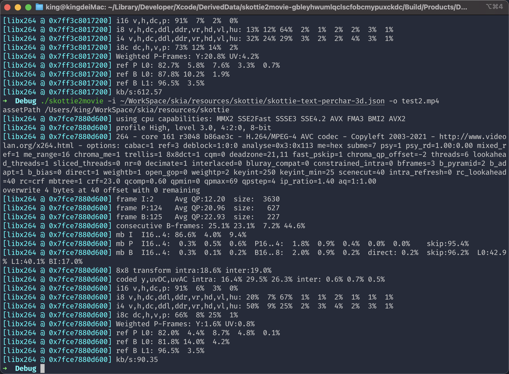

# SkiaDemo
* Skia 官方示例demo可运行
* `skottie_ios_app` `iOS`端使用`Skia`渲染`Lottie`
* `skottie2movie` 用`Skia`渲染`Lottie`生成视频文件

# 编译Skia
* [先按照此页面步骤执行](https://skia.org/docs/user/download/)
* 编译 `iOS`
```shell
cd skia
mkdir -p out/ios_arm64
cat << EOF > out/ios_arm64/args.gn
cc="clang"
cxx="clang++"
target_os="ios"
target_cpu="arm64"
is_debug=false
is_official_build=true
skia_enable_pdf=false
skia_use_icu=false
skia_use_libpng_decode=false
skia_use_libpng_encode=false
skia_use_libwebp_decode=false
skia_use_libwebp_encode=false
skia_use_libjpeg_turbo_decode=false
skia_use_libjpeg_turbo_encode=false
extra_cflags=["-I/Applications/Xcode.app/Contents/Developer/Platforms/iPhoneOS.platform/Developer/SDKs/iPhoneOS.sdk/usr/include","-I/usr/local/include"]
extra_cflags_cc=["-I/Applications/Xcode.app/Contents/Developer/Platforms/iPhoneOS.platform/Developer/SDKs/iPhoneOS.sdk/usr/include","-I/usr/local/include"]
skia_enable_gpu=true
skia_use_vulkan=false
skia_use_gl=false
skia_use_metal=true
EOF

bin/gn gen out/ios_arm64
ninja -C out/ios_arm64 skia
# 或者编译全部
# ninja -C out/ios_arm64
```
* 编译 `macOS` M1 需要将 `x64` 改为 `arm64`
```shell
cd skia
mkdir -p out/macosx
cat << EOF > out/macosx/args.gn
cc="clang"
cxx="clang++"
target_os="mac"
target_cpu="x64"
is_debug=false
is_official_build=true
skia_enable_pdf=false
skia_use_icu=false
skia_use_libpng_decode=false
skia_use_libpng_encode=false
skia_use_libwebp_decode=false
skia_use_libwebp_encode=false
skia_use_libjpeg_turbo_decode=false
skia_use_libjpeg_turbo_encode=false
extra_cflags=["-I/Applications/Xcode.app/Contents/Developer/Platforms/MacOSX.platform/Developer/SDKs/MacOSX.sdk/usr/include","-I/usr/local/include"]
extra_cflags_cc=["-I/Applications/Xcode.app/Contents/Developer/Platforms/MacOSX.platform/Developer/SDKs/MacOSX.sdk/usr/include","-I/usr/local/include"]
skia_enable_gpu=true
skia_use_vulkan=false
skia_use_gl=false
skia_use_metal=true
EOF

bin/gn gen out/macosx
ninja -C out/macosx skia
# 或者编译全部
# ninja -C out/macosx
```

# 效果


* [生成示例一视频](test.mp4)
* [生成示例二视频](test2.mp4)
